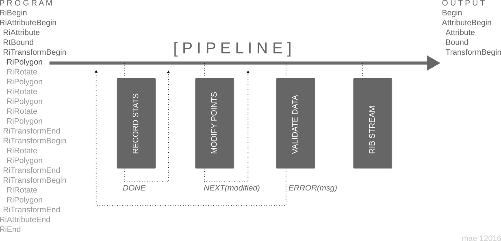

#RiGO  	  

Implementation of the RenderMan Interface for the Go programming language. This is currently 
based on Pixar's RenderMan Specification version 3.2.1 (November 2005). This implementation 
is still under *active development*, so *expect* holes and bugs. 

[Online Documentation](https://godoc.org/github.com/mae-global/rigo)

Install with:

    go get github.com/mae-global/rigo

Quick example usage; outputting a Unit Cube to a RIB Entity file. 



```go
/* create a function to record the duration between RiBegin and RiEnd calls */
type MyTimer struct {
	start time.Time
	finish time.Time
}

func (t *MyTimer) ToRaw() ArchiveWriter {
	return nil
}

func (t MyTimer) Name() string {
	return "mytimer"
}

func (t *MyTimer) Took() time.Duration {
	return t.finish.Sub(t.start)
}

func (t *MyTimer) Pipe(name RtName,args,params,values []Rter,info Info) *Result {
	switch string(name) {
		case "Begin","RiBegin":
			t.start = time.Now()
			t.finish = t.start
		break
		case "End","RiEnd":
			t.finish = time.Now()
		break
	}
	return Done()
}

/* Construct a pipeline, including our timer, piping RIB output to file */
pipe := NewPipe()
pipe.Append(&MyTimer{}).Append(&PipeToFile{})

ri := CustomEntityPipeline(pipe)

/* Do all our Ri calls */
ri.Begin("unitcube.rib")
ri.AttributeBegin("begin unit cube")
	ri.Attribute("identifier", RtToken("name"), RtToken("unitcube"))
	ri.Bound(RtBound{-.5, .5, -.5, .5, -.5, .5})
	ri.TransformBegin()

		points := RtFloatArray{.5, .5, .5, -.5, .5, .5, -.5, -.5, .5, .5, -.5, .5}

		ri.Comment("far face")
		ri.Polygon(4, RtToken("P"), points)
		ri.Rotate(90, 0, 1, 0)

		ri.Comment("right face")
		ri.Polygon(4, RtToken("P"), points)
		ri.Rotate(90, 0, 1, 0)

		ri.Comment("near face")
		ri.Polygon(4, RtToken("P"), points)
		ri.Rotate(90, 0, 1, 0)

		ri.Comment("left face")
		ri.Polygon(4, RtToken("P"), points)

	ri.TransformEnd()
	ri.TransformBegin()

		ri.Comment("bottom face")
		ri.Rotate(90, 1, 0, 0)
		ri.Polygon(4, RtToken("P"), points)

		ri.TransformEnd()
		ri.TransformBegin()

		ri.Comment("top face")
		ri.Rotate(-90, 1, 0, 0)
		ri.Polygon(4, RtToken("P"), points)

	ri.TransformEnd()
ri.AttributeEnd("end unit cube")
ri.End()	
		
/* grab our timer back and print the duration */
p = pipe.GetByName(MyTimer{}.Name())
t,_ := p.(*MyTimer)
	
fmt.Printf("took %s\n",t.Took())
```	

RIB output of *unitcube.rib* is thus :-

```
##RenderMan RIB-Structure 1.1 Entity
AttributeBegin #begin unit cube
	Attribute "identifier" "name" "unitcube"
	Bound [-.5 .5 -.5 .5 -.5 .5]
	TransformBegin 
		# far face
		Polygon "P" [.5 .5 .5 -.5 .5 .5 -.5 -.5 .5 .5 -.5 .5]
		Rotate 90. 0 1. 0
		# right face
		Polygon "P" [.5 .5 .5 -.5 .5 .5 -.5 -.5 .5 .5 -.5 .5]
		Rotate 90. 0 1. 0
		# near face
		Polygon "P" [.5 .5 .5 -.5 .5 .5 -.5 -.5 .5 .5 -.5 .5]
		Rotate 90. 0 1. 0
		# left face
		Polygon "P" [.5 .5 .5 -.5 .5 .5 -.5 -.5 .5 .5 -.5 .5]
	TransformEnd 
	TransformBegin 
		# bottom face
		Rotate 90. 1. 0 0
		Polygon "P" [.5 .5 .5 -.5 .5 .5 -.5 -.5 .5 .5 -.5 .5]
	TransformEnd 
	TransformBegin 
		# top face
		Rotate -90. 1. 0 0
		Polygon "P" [.5 .5 .5 -.5 .5 .5 -.5 -.5 .5 .5 -.5 .5]
	TransformEnd 
AttributeEnd #end unit cube
```

An example light handler generator, which generates unique names so that lights can be tracked more easily. 

```go
pipe := DefaultFilePipe()
	
/* use a custom unique generator with a prefix for the light handles */
lights := NewPrefixLightUniqueGenerator("light_")
	
ctx := NewContext(pipe,lights,nil,nil,&Configuration{PrettyPrint:true})
ri := RI(ctx)
ri.Begin("output/simple.rib")
ri.Display("sphere.tif","file","rgb")
ri.Format(320,240,1)
ri.Projection(Perspective,RtToken("fov"),RtFloat(30))
ri.Translate(0,0,6)
ri.WorldBegin()
	ri.LightSource("ambientlight",RtToken("intensity"),RtFloat(0.5))
	ri.LightSource("distantlight",RtToken("intensity"),RtFloat(1.2),RtToken("from"),RtIntArray{0,0,-6},RtToken("to"),RtIntArray{0,0,0})
	ri.Color(RtColor{1,0,0})
	ri.Sphere(1,-1,1,360)
ri.WorldEnd()
ri.End()
```

```
##RenderMan RIB-Structure 1.1
Display "sphere.tif" "file" "rgb"
Format 320 240 1
Projection "perspective" "fov" 30
Translate 0 0 6
WorldBegin 
	LightSource "ambientlight" "light_09c84b71" "intensity" .5
	LightSource "distantlight" "light_64f4dfbf" "intensity" 1.2 "from" [0 0 -6] "to" [0 0 0]
	Color [1 0 0]
	Sphere 1 -1 1 360
WorldEnd 
```


##Roadmap

- [ ] Regression tests
  - [ ] Basic RIB outputs against expected
  - [ ] Image Comparsion against expected -- tiffdiff
  - [ ] RIB output comparsion from PRMan
- [ ] Ability to run an output to an application from RiBegin
- [x] ~~Structure block for recording context settings in RIB output~~ Moved to tools (outside of this package)
- [x] ~~Basic RIB pipe~~
- [ ] Complete RenderMan Interface
- [ ] Filters
  - [ ] Inline replacement
  - [ ] RIB outputer
- [ ] Stdout/buffer wrapper around io.Writer interface
- [ ] Complete Error checking for each Ri Call
  - [x] ~~Basic Error checking~~
	- [ ] Sanity checking
	- [ ] Per call checking
	- [ ] Parameterlist checking
- [ ] RIB parser
- [ ] RIS
  - [x] ~~Args Parser~~
  - [x] ~~Shader loader~~
  - [x] ~~Param~~
  - [x] ~~Widget~~
  - [ ] Ri intergration 
- [ ] Call wrapping for Ri[call]Begin/Ri[call]End pairs
- [x] ~~Call Fragments~~ 
- [ ] Documentation/Examples
  - [ ] examples autogenerated from example tests
- [x] ~~Siggarph 2003, Course 9 'Evolution of RIB' by Byron Bashforth~~
  - [x] ~~String Handles~~
  - [x] ~~Conditional RIB and State Variable Subsitution~~
  - [x] ~~inline Archives~~
  - [x] ~~Plug-in Ri Filters (partial)~~
  - [x] ~~Multipart RIB and Plug-in Instancers~~


###Information

RenderMan Interface Specification is Copyright © 2005-2016 Pixar.
RenderMan © is a registered trademark of Pixar.

